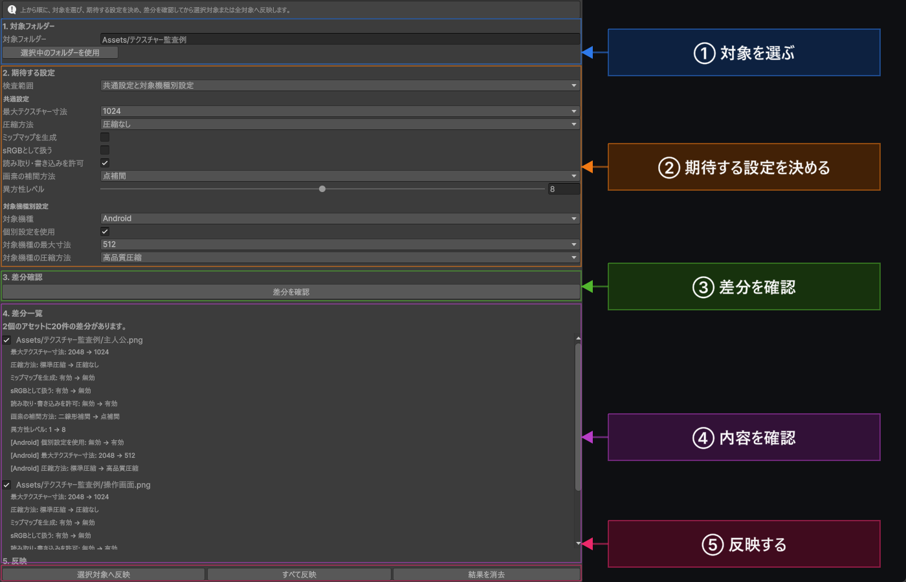
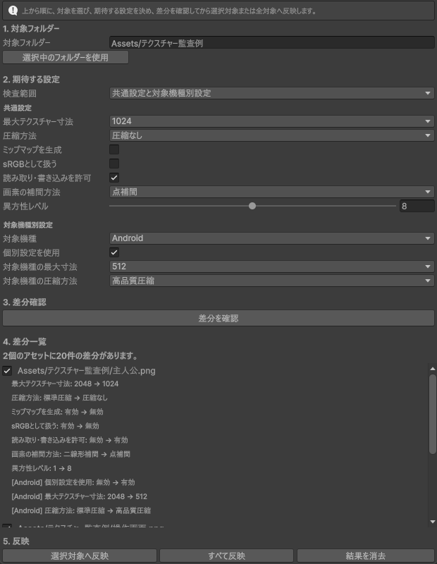

# テクスチャー取込設定監査 1.2.0

## 目的

テクスチャー取込設定のばらつきを、対象フォルダー単位で確認して安全にそろえます。共通設定に加え、パソコン・Android・iOS向けの個別設定を同じ画面で確認できます。ビルドガードはシーンとプレハブの不備、参照検索は参照と名前変更、このモジュールは取込設定を担当します。

## 操作順

1. ①`Assets`配下の対象フォルダーを選びます。
2. ②「検査範囲」を「共通設定」「対象機種別設定」「共通設定と対象機種別設定」から選び、期待値を設定します。
3. ③「差分を確認」を押します。
4. ④パスごとの現在値と期待値を確認します。
5. ⑤「選択対象へ反映」または「すべて反映」を押します。

## 共通設定と対象機種別設定

| 検査範囲 | 比較・反映する値 |
| --- | --- |
| 共通設定 | 最大テクスチャー寸法、圧縮方法、ミップマップ生成、sRGB色空間、読み取り・書き込み、画素の補間方法、異方性レベル |
| 対象機種別設定 | パソコン・Android・iOSの個別設定、最大寸法、圧縮方法 |
| 共通設定と対象機種別設定 | 上記の両方 |

パソコンはUnity内部の`Standalone`設定、iOSは`iPhone`設定へ対応します。有効なビルド対象は変更しません。個別設定を無効にする場合は有効状態だけを変更し、最大寸法、圧縮方法、形式、寸法変更方法など他の値は保持します。

最大テクスチャー寸法はUnityの取込設定が表示する32～16384の選択肢から選びます。任意の整数を入力して取込処理側の補正と差分再確認を繰り返す状態にはしません。

## 反映前の確認

反映前に、選択対象すべての管理対象値を差分確認時点の記録と比較します。1件でも取込設定が消失・変更していれば、選択対象を一部だけ変更せず`StalePlan`で停止します。未選択アセットの変更は、選択したアセットへの反映を妨げません。

## 変更されないもの

パッケージ配下、シーン、プレハブ、マテリアル、アセット参照、ファイル名、画像データ、有効なビルド対象は変更しません。対象機種固有の形式、寸法変更方法、`Crunch`、圧縮品質、透明度分離、Androidの`ETC2`代替設定も変更しません。

## 再取込

反映したテクスチャーはUnityの通常処理で再取込されます。大きなフォルダーでは時間とメモリを使うため、小さい下位フォルダーから確認してください。

## Unity公式資料

- [対象機種別テクスチャー設定](https://docs.unity3d.com/ja/current/Manual/class-TextureImporter-type-specific.html)
- [TextureImporterPlatformSettings](https://docs.unity3d.com/ja/current/ScriptReference/TextureImporterPlatformSettings.html)
