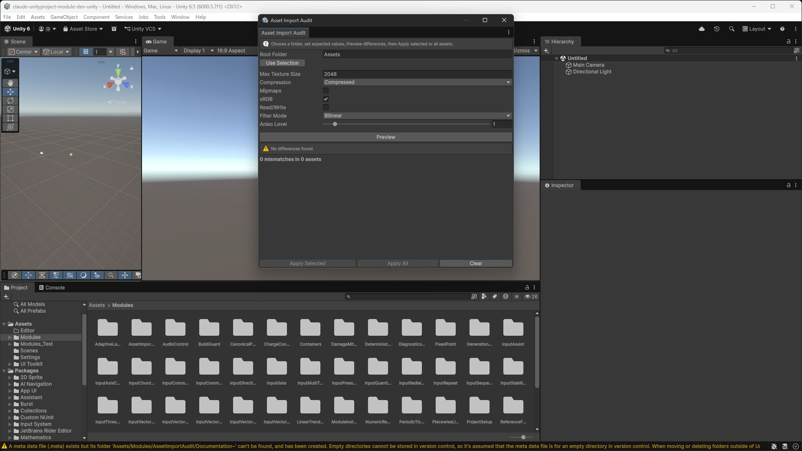

# テクスチャー取込設定監査

## 30秒で分かる説明

テクスチャー取込設定をフォルダー単位で一覧化し、共通設定とパソコン・Android・iOS向け設定をまとめてそろえるエディター専用ツールです。テクスチャーを1枚ずつ選び、インスペクター下部の対象機種タブを何度も開く作業を、差分確認から反映までの5段階にまとめます。

## できること

- `Assets`配下の`Texture2D`を一定のパス順で検査する。
- 共通の最大寸法、圧縮方法、ミップマップ、sRGB色空間、読み取り・書き込み、画素の補間方法、異方性レベルを比較・反映する。
- パソコン・Android・iOSの個別設定、最大寸法、圧縮方法を比較・反映する。
- 共通設定だけ、対象機種別設定だけ、または両方を一度に確認する。
- 最大寸法をUnityの取込設定に用意された値（32～16384）から選び、再確認で確実に差分がなくなるようにする。
- 差分確認後の外部変更を検出し、選択対象を一部だけ更新せず全件停止する。
- 選択したアセットだけ、または差分のあるアセット全件へ反映する。

## 使わない方がよい場合

画像を見て自動的に最適な圧縮形式を選びたい場合や、`Addressables`・`Resources`の参照、未使用アセット、削除・名前変更を調べたい場合には向きません。このツールは利用者が決めた取込設定を安全にそろえる用途へ限定しています。

## 3分で試す

1. Unityのパッケージ管理画面（`Window > Package Management > Package Manager`）を開き、`Add package from git URL...`へ次を入力します。

   ```text
   https://github.com/mynameisGaku/UnityModules.git?path=/AssetImportAudit#asset-import-audit-v1.2.0
   ```

2. `Tools > テクスチャー取込設定監査 > 開く`を開きます。
3. ①「対象フォルダー」へ`Assets/Art/Textures`などを入力するか、プロジェクト画面でフォルダーを選んで「選択中のフォルダーを使用」を押します。
4. ②「検査範囲」を選び、共通設定または対象機種別設定の期待値を決めます。iOSはUnity内部の`iPhone`設定へ対応します。
5. ③「差分を確認」を押します。
6. ④アセットごとの現在値と期待値を確認し、反映するアセットを選びます。
7. ⑤「選択対象へ反映」または「すべて反映」を押します。


<details>
<summary>注釈を加える前の実際のエディター画面</summary>



</details>

## 実行するとどうなるか

差分があるアセットはパスごとに並び、共通設定は設定名、対象機種別設定は「パソコン」「Android」「iOS」付きで現在値から期待値への変化を表示します。反映すると対象テクスチャーがUnityの通常処理で再取込され、完了後に同じ条件で差分を再確認します。差分がなくなれば「差分はありません。」と表示されます。

対象機種別設定を無効にする場合は、個別設定だけを無効化します。テクスチャー形式、寸法変更方法、圧縮品質など、このモジュールが所有しない対象機種別設定は保持します。有効なビルド対象は切り替えません。

## よくある問題

### 反映が`StalePlan`で止まる

差分確認後にインスペクター、スクリプト、別のエディター拡張などが対象の取込設定を変更しています。現在の状態を勝手に上書きしないための停止です。もう一度差分を確認してください。

### 対象機種の圧縮形式を自動選択してほしい

端末世代、画質、透明度、配布先によって正解が異なるため、自動推測しません。このモジュールが扱う`TextureImporterCompression`はUnityの低品質・標準・高品質に相当する方針です。具体的な描画用形式はUnityの取込設定と利用側の対象機種方針で決めてください。

### 大きなフォルダーで時間がかかる

反映したテクスチャーは再取込されます。最初は小さい下位フォルダーを選び、差分と所要時間を確認してから範囲を広げてください。

## 公開API

- `AssetImportAuditTextureSettings`: 共通のテクスチャー取込設定。
- `AssetImportAuditTexturePlatformSettings`: 対象機種別設定の期待値。
- `AssetImportAuditTextureAuditSettings`: 共通・対象機種別・両方の検査範囲。
- `AssetImportAuditService.Preview`: 差分と再確認用計画を作成する。
- `AssetImportAuditService.Apply`: 計画を全件または選択アセットへ反映する。
- `AssetImportAuditPlan` / `AssetImportAuditIssue` / `AssetImportAuditApplyResult`: 差分確認と反映結果を表す値。

## 変更範囲と失敗条件

- 対象は入力した`Assets`フォルダー以下の`Texture2D`だけです。
- パッケージ、シーン、プレハブ、マテリアル、参照、ファイル名、画像データは変更しません。
- 選択対象への反映では、選択した全取込設定を先に再確認します。1件でも消失・変更していれば、選択対象を1件も変更しません。
- 反映開始後に予期しない例外が起きた場合は、例外前に再取込まで完了した件数を返し、記録済みの変更を一つの取り消し単位へまとめます。ただし、Unityの取込処理が一部を書き込んでから失敗した場合の一括復元は保証しません。結果が`ApplyFailed`の場合は取込設定を確認して差分を再確認してください。
- `ApplyFailed`の`AppliedAssetCount`には、例外が起きる前に再取込まで完了したアセット数が入ります。
- 対象機種別の形式、寸法変更方法、`Crunch`、圧縮品質、透明度分離、Androidの`ETC2`代替設定は変更しません。

## 非目標

`Addressables`・`Resources`の依存解析、未使用アセット判定、画像内容の品質判定、ファイル削除・名前変更、参照置換、ビルド時の自動変更、有効なビルド対象の切替、対象機種別形式の自動推測は扱いません。
