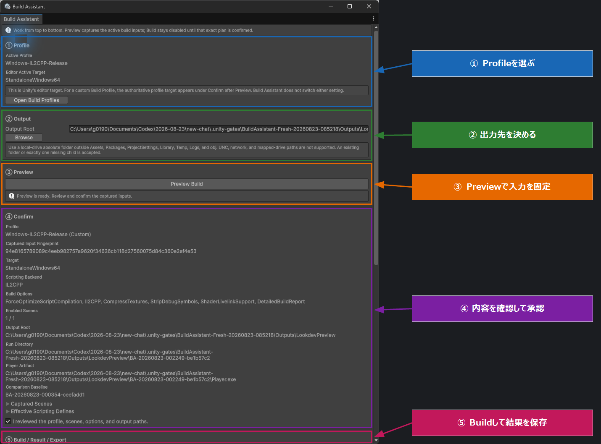
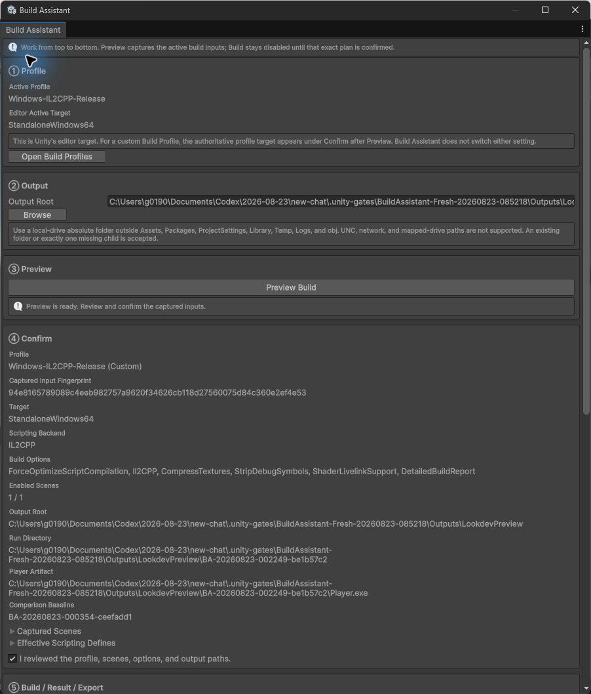
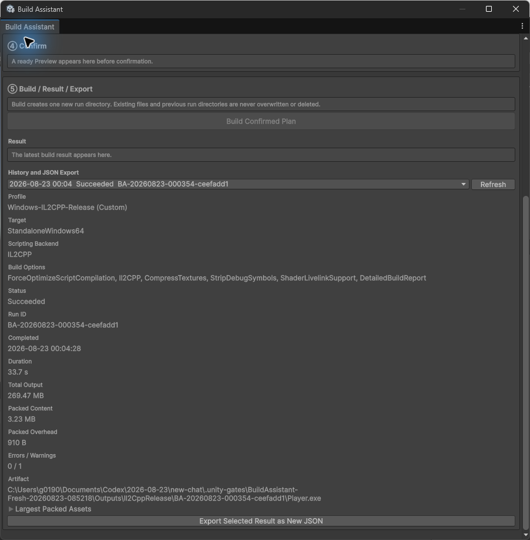

# ビルド実行アシスタント（Build Assistant）1.0.0

Build Assistant は、Unity のデスクトップ向け Standalone ビルドについて「何を、どこへビルドするか」を実行前に確認し、その計画だけを安全な新規フォルダーへ出力する Editor 専用モジュールです。

## まず行うこと

`Tools > Build Assistant > Open` を開き、次の順番を変えずに操作します。

- ① `Profile` で現在有効な `Build Profile` と対象を確認する
- ② `Output` で出力先の基準フォルダーを指定する
- ③ `Preview` で設定と入力内容を記録する
- ④ `Confirm` で記録内容を確認して同意する
- ⑤ `Build / Result / Export` でビルドし、結果を確認・書き出す

`Preview` は設定後に行う必要があるため、`Profile` と `Output` より下にあります。`Confirm` と `Build` は、準備できた `Preview` がある場合だけ進められます。



この画像は Unity `6000.5.7f1` の実画面に、対応する枠と矢印だけを重ねたものです。設定・確認・実行の順番を入れ替えずに進めてください。

<details>
<summary>注釈のない Preview 画面と結果画面</summary>





</details>

## ① `Profile`

①には Unity Editor が現在選んでいる対象を `Editor Active Target` として表示します。カスタム `Build Profile` が実際に使う対象は③で取得し、④の `Target` に表示します。Build Assistant 自身は `Build Profile`、ビルド対象、`EditorUserBuildSettings`、`PlayerSettings` を変更しません。

対応するのは、インストール済みプラットフォームモジュールで作成できる次のクライアント向け対象です。

- `StandaloneWindows64`
- `StandaloneOSX`
- `StandaloneLinux64`

`Server` サブターゲット、32-bit Windows、モバイル、Web、コンソールは対象外です。

`ProfilerUserSettings.customConnectionID` に値がある場合に Unity が追加する `BuildOptions.CustomConnectionID` も 1.0.0 の対象外です。確認表示と実行内容が一致しない状態を避けるため、値が空でない場合は③の計画作成前に拒否します。

カスタム `Build Profile` は、そのアセットに保存された対象とサブターゲットを実際のビルド基準にします。Project 内に保存されていないプロファイル、GUID がないプロファイル、依存関係ハッシュを取得できないプロファイルは、あとから同一性を確認できないため利用できません。

## ② `Output`

`Output Root` には完全な絶対パスを指定します。OS がローカルの固定ファイルシステムとして報告する場所だけを利用できます。UNC、ネットワーク、割り当てドライブ、判定できないファイルシステムは対象外です。

指定可能な形は次の 2 種類です。

- すでに存在するフォルダー
- すでに存在するフォルダーの直下にある、まだ作られていないフォルダー 1 つ

2 階層以上を一度に作るパス、既存ファイルのパス、ドライブ相対パスは拒否します。また、Project の `Assets`、`Packages`、`ProjectSettings`、`Library`、`Temp`、`Logs`、`obj` と重なる場所、そこへ入る場所、そこを包含する場所は利用できません。途中にシンボリックリンクやジャンクションなどの再解析ポイントがある場合も利用できません。

Windows では既存フォルダーの物理的な正規パスとローカルドライブ種別も確認します。`\\?\`、`\\.\` などのデバイス名前空間、NTFS の代替データストリームを表す余分な `:`、`CON` や `NUL` などの予約デバイス名は入力として受け付けません。macOS と Linux では、OS が列挙するマウント点のうち入力パスに最も近いものを使い、固定ファイルシステムと報告された場合だけ許可します。OS から種別を取得できない場合は安全を確認できないため拒否します。

## ③ `Preview`

`Preview Build` は読み取りだけを行います。出力フォルダー、履歴、実行状態を作成せず、Unity のビルド場所選択画面も開きません。

計画には次の項目を記録します。

- 現在有効な `Build Profile` の種類、GUID、アセットパス、名前、依存関係ハッシュ
- 対象、対象グループ、名前付き対象、サブターゲット、`Scripting Backend`
- 実際に適用される `Build Options`、有効な定義、AssetBundle manifest のパス
- ビルドシーンの順序、有効状態、GUID、アセットパス、依存関係ハッシュ
- `ProjectSettings` 以下の設定ファイル
- `Library/BuildProfiles` 以下のプロファイル設定ファイル
- `Library/EditorUserBuildSettings.asset`
- `AssetDatabase.GlobalArtifactDependencyVersion` と `AssetDatabase.GlobalArtifactProcessedVersion`
- `Packages/manifest.json` と `Packages/packages-lock.json`
- `Assets/StreamingAssets` 以下のファイル名と内容
- 正規化した出力先の基準フォルダー、実行フォルダー、プレイヤーのパス
- 条件が一致する直近の成功結果

各ファイルの記録は、形式番号、件数、パス長、内容長を含む区切りの明確なハッシュにまとめます。ファイルの追加・削除・並べ替え・内容変更を区別します。

有効なシーンは `Assets` または `Packages` 以下の正規化済み `.unity` パスで、存在し、`SceneAsset` として読み込めて、有効な GUID と依存関係ハッシュを持つ必要があります。無効なシーンは確認情報として保持しますが、ビルド対象には渡しません。

### 安全側の再確認

`Build Confirmed Plan` の直前に同じ情報をもう一度取得し、③で記録した内容と比較します。1 項目でも異なる場合は `StalePlan` で停止します。

この比較は安全側に広く判定します。たとえば、別のデスクトップ対象の `Library/BuildProfiles` 設定や、今回のプレイヤーから参照されない読み込み済みアセットを変更しただけでも、計画が古いと判定されることがあります。これは変更を見落として意図しない内容をビルドするよりも、もう一度 `Preview Build` を求める方を選ぶ 1.0.0 の仕様です。

## ④ `Confirm`

表示された `Profile`、`Target`、`Scripting Backend`、`Build Options`、シーン、出力パスを確認してから、確認欄をオンにします。出力先を変更すると計画と確認状態は破棄されます。

カスタム `Build Profile` の圧縮方式や開発用設定は、実際に適用される `Build Options` として確認画面・履歴・比較条件に含めます。一方、実行時は Unity の `BuildPlayerWithProfileOptions` がプロファイルから適用するため、同じプロファイル所有値を追加の上書き値として二重に渡しません。

## ⑤ `Build / Result / Export`

ビルド開始時は次の順番で安全確認します。

1. Build Assistant 内と Unity 内で別のプレイヤービルドが動いていないことを確認する
2. Unity がコンパイル、更新、Play Mode への切り替え中でないことを確認する
3. ③の記録と現在の設定・入力内容が一致することを確認する
4. 新しい実行フォルダーを排他的に作成する
5. 実行中であることを `Library/BuildAssistant` に保存する
6. 出力先の同一性、再解析ポイント、予約ファイル、プレイヤーパスをもう一度確認する
7. Unity のビルド処理を 1 回だけ呼び出す

実行フォルダー名は `BA-yyyyMMdd-HHmmss-8hex` 形式です。Windows は排他的なディレクトリ作成 API を使い、ビルド中は削除共有を許可しないディレクトリハンドルを保持します。Unix 系も排他的な `mkdir` で通常の同名作成競合を防ぎます。ただし、Unix 系で権限を持つ外部処理がビルドと同時に意図的な置換や再マウントを行う状況までは保証対象にしません。

既存の実行フォルダー、既存プレイヤー、予約後に追加されたファイルが見つかった場合は上書きせず停止します。Build Assistant は以前の実行フォルダーを削除しません。

## 結果と容量

Unity が返した `BuildReport` は、その場で通常の C# 値へ縮約します。Unity の Object や過去の `BuildReport` を保持せず、`GetLatestReport` も使用しません。

保存する主な情報は次のとおりです。

- 成功・失敗・中断
- 開始・完了時刻と所要時間
- 警告数とエラー数
- 出力全体の容量
- パックされた内容の容量と、その差分である付帯容量
- アセット別・型別のパック容量
- 比較可能な直近成功結果との差

容量の比較対象は、プロファイルの識別情報、対象、サブターゲット、`Scripting Backend`、実際に適用される `Build Options` が一致する直近の成功結果です。シーンのハッシュは比較対象を選ぶ条件には含めません。

アセット容量の読み取りだけが失敗しても、Unity が成功を報告した事実は失敗に書き換えません。ビルド成功と履歴保存成功も別々に返します。

## 履歴と中断復旧

履歴と実行状態は Project の `Library/BuildAssistant` に保存します。

- `history.json`: 新しい順に最大 20 件
- `history.json.bak`: 更新前の予備
- `run-state.json`: 実行中または完了済みの一時状態
- 各 `.tmp`: 同一フォルダー内での置き換え用一時ファイル

書き込みは一時ファイルへの書き込みと同期を終えてから、主ファイルと予備を入れ替えます。主ファイルが壊れている場合は、形式と内容を検証した予備から読み込みます。

Unity が実行中に終了し、次回読み込み時に未完了の実行状態だけが残っていた場合は `Interrupted` として履歴へ追加します。成功・失敗がすでに履歴へ保存済みの場合は、その結果を `Interrupted` で置き換えません。自動再実行は行いません。

## JSON 書き出し

`Export Selected Result as New JSON` は、選択した 1 件を schema 1 の JSON として新規作成します。

- `.json` で終わる安全な絶対パスだけを受け付けます。
- 親フォルダーは存在している必要があります。
- 親フォルダーは OS がローカルの固定ファイルシステムとして報告する場所に限り、途中に再解析ポイントがある場合や Unity 管理フォルダーと重なる場合は拒否します。
- Windows では書き込みが終わるまで親フォルダーの削除共有を許可しないハンドルを保持し、確認後の置換を防ぎます。
- 既存ファイルは上書きしません。
- 新規作成後の書き込みに失敗した場合は、自分で作った不完全なファイルを可能な範囲で削除します。
- 書き出し時刻など、その場で変化する余分な値は追加しません。

## 公開 API

名前空間は `BuildAssistant.Editor` です。

```csharp
BuildAssistantPlan plan = BuildAssistantService.Preview(absoluteOutputRoot);
BuildAssistantBuildResult result = BuildAssistantService.Build(plan);
BuildAssistantHistory history = BuildAssistantService.LoadHistory();
BuildAssistantError error = BuildAssistantService.ExportJson(entry, absoluteNewJsonPath);
```

公開される計画、結果、履歴、シーン、容量データは作成後に内容が変わらない値です。公開コレクションは呼び出し元の配列を保持せず、読み取り専用の複製を返します。計画には Unity Object を保持しません。

## 主な失敗理由

| 値 | 意味 |
|---|---|
| `InvalidOutputRoot` | 出力先が空、相対パス、ファイル、または未作成階層が深すぎます。 |
| `UnsafeOutputPath` | Unity 管理フォルダー、再解析ポイント、ネットワーク系パスなど、安全条件を満たしません。 |
| `UnsupportedBuildTarget` | 対象、サブターゲット、プラットフォームモジュール、プロファイル、またはオプションが対応範囲外です。 |
| `EditorBusy` | Unity がコンパイル、更新、Play Mode 切り替え中です。 |
| `NoEnabledScenes` | 有効なビルドシーンがありません。 |
| `StalePlan` | ③の記録後に設定または入力内容が変わりました。 |
| `BuildAlreadyRunning` | Build Assistant または Unity がすでにプレイヤーをビルド中です。 |
| `OutputAlreadyExists` | 実行フォルダー、予約、プレイヤー、または JSON がすでに存在します。 |
| `OutputReservationFailed` | 出力先または実行状態を安全に予約できません。 |
| `BuildInvocationFailed` | Unity のビルド処理を開始できないか、実行中に例外が発生しました。 |
| `BuildReportUnavailable` | Unity から `BuildReport` が返りませんでした。 |
| `ReportReadFailed` | `BuildReport` の容量情報を通常の値へ縮約できませんでした。 |
| `HistoryWriteFailed` | 履歴または明示的な JSON を永続化できませんでした。 |
