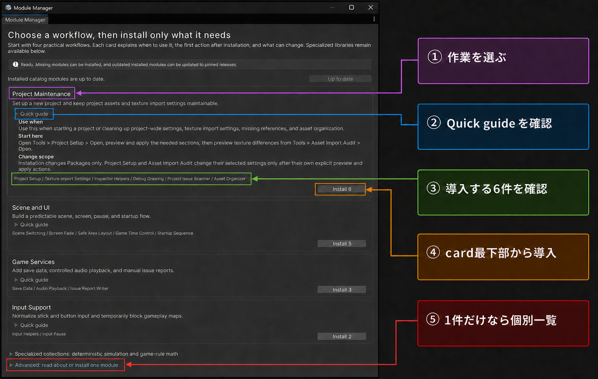
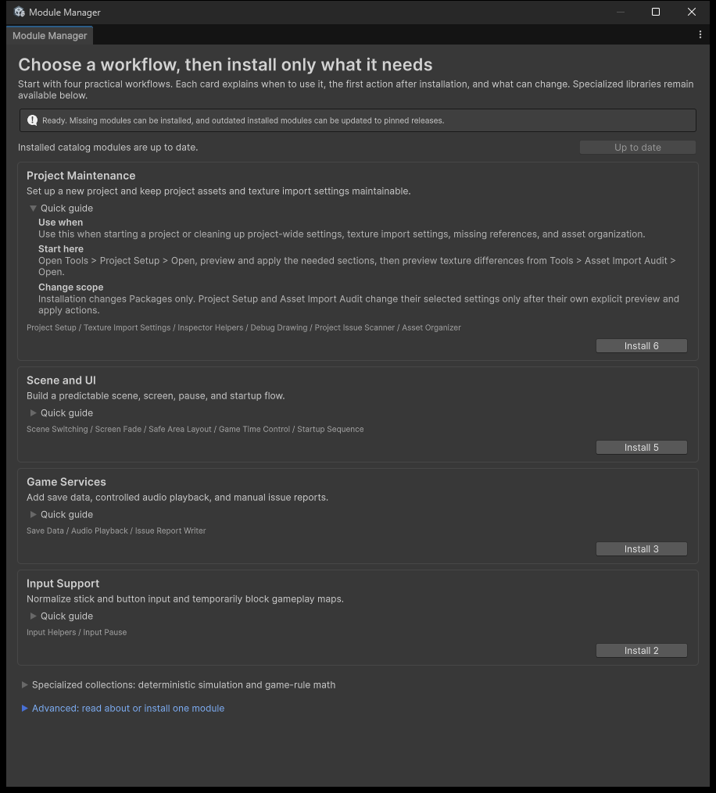
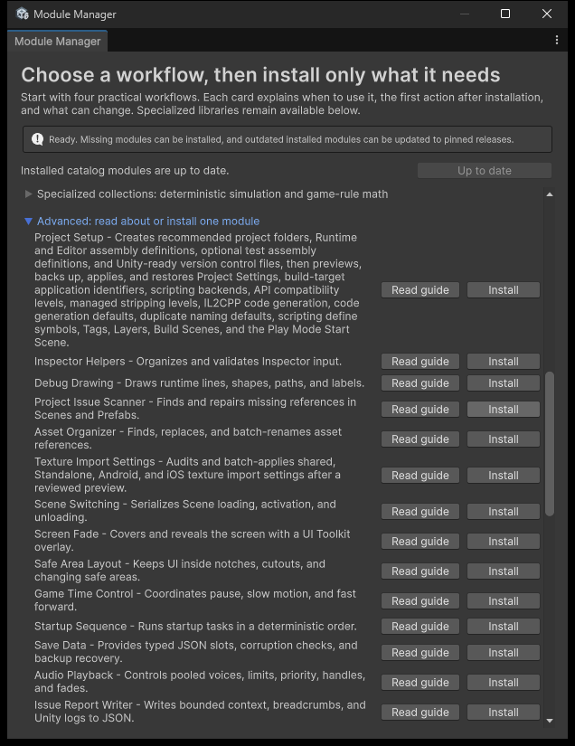

# Module Manager 1.4.7

## 目的

公開済みUnityModulesを4つの実用workflowへまとめ、固定tagのGit URLとして追加し、導入済みの古いversionをまとめて更新するEditor toolです。利用者が似たmodule名、URL、最新公開versionを暗記する必要をなくします。

## 操作

`Tools > Module Manager > Open`を開き、次の順番で操作します。

① やりたい作業に合うworkflowを選びます。最初は`Project Maintenance`を確認します。

② card上部の概要を読み、`Quick guide`を開いて用途、最初の操作、変更範囲を確認します。

③ `Quick guide`の下に表示されるmodule名と追加件数を確認します。

④ card最下部の`Install N`を押し、Package Managerの解決とdomain reloadを待ちます。

⑤ 1件だけ導入する場合は、さらに下の個別一覧を開きます。

実画面でも、概要、`Quick guide`、導入package、card最下部の`Install N`、個別一覧が上から下へ並びます。

個別導入は`Advanced: read about or install one module`から実行します。`Read guide`はcatalogに固定した公開tagのREADMEを開きます。

導入済みmoduleに更新がある場合は、上部に`Module Name -> target version`が表示されます。対象を確認して`Update N`を押すと、古いversionだけを1回のPackage Manager要求で更新します。

最初に41件の個別一覧を読む必要はありません。新規Projectの基本フォルダー、C#生成既定値、条件付きコンパイル記号、Texture import設定、Asset整理は`Project Maintenance`、Scene切り替えやUIは`Scene and UI`、save・音声・reportは`Game Services`、入力補助は`Input Support`から確認します。決定論と細かなゲーム計算は`Specialized collections`へ分離しています。個別一覧は必要なmoduleが明確な場合や既存projectとの互換用です。

Project Maintenanceの「プロジェクト一括設定」はv1.15.0へ固定されています。基本フォルダー、Runtime・Editor・test用asmdef、Unity向け`.gitignore`と`.gitattributes`をまとめて作成できます。既存fileは上書きせず、復元ではこのツールが作成して内容が変わっていないfileだけを削除します。利用者が編集したfile、既存フォルダー、Assetを追加したフォルダーは維持します。build target別Application Identifier・Scripting Backend・API Compatibility Level・Managed Stripping Level・IL2CPP Code Generation、C# Root Namespace、新規scriptの改行方式、複製時のGameObject・Asset命名規則、条件付きコンパイル記号、Tag・Layer・Sorting Layer、Player Build Scenes、Play Mode開始Sceneも同じprofileから適用・復元できます。

同じworkflowの「アセット設定チェック」はv1.1.0へ固定されています。Textureの共通設定とStandalone・Android・iOSのOverride、最大size、圧縮方針を対象ごとに比較します。`Preview`は差分を表示するだけで、確認後に`Apply`した選択済みTexture importerだけを更新・再importします。Preview後に対象が変わった場合は適用を中止します。

## 変更される範囲

- Module Managerの導入操作は`Packages/manifest.json`と`Packages/packages-lock.json`へ固定tagのpackageを追加します。
- workflowを導入しただけでは、Project Settings、Scene、Prefab、Asset importerを変更しません。
- 導入後の各toolは、それぞれの画面で対象を選び、previewとapplyを明示した範囲だけを変更します。

## 安全条件

- catalogに無いpackage名は受理しません。
- URLはrepository、subfolder、公開tagを固定し、任意入力を受けません。
- 導入済みpackageは追加対象から除外します。
- 更新対象は、導入済みversionを数値比較でき、catalogのversionより古いpackageだけです。新しいversionや独自versionは上書きしません。
- `Assets/Modules/<Folder>`が存在するmoduleは、assembly重複を避けるため導入を停止します。
- 1回の操作は1つの`Client.AddAndRemove`要求として実行し、package削除は要求しません。
- 失敗時はqueueを終了し、同じ要求を無限に再試行しません。
- workflowと個別packageのbuttonは未導入件数、導入済み、Assets copy競合を表示します。
- workflow guideはPackage導入自体と、導入後のtool操作が変更する範囲を分けて表示します。
- 個別README URLはcatalogと同じ公開tagへ固定します。

## 状態復元

導入・更新対象は`SessionState`へ保存します。domain reload後、全対象が目的versionへ到達していれば完了としてqueueを消去します。対象が残る場合は、同じ固定URL集合でPackage Manager要求を再開できます。

Unity Editor自体を終了すると`SessionState`は保証されません。再起動後はwindowを開き直し、未導入分を再選択してください。

## 非対象

- packageのdowngrade、削除
- 任意Git URLやregistryの入力
- `Assets/Modules` copyの自動移動・削除
- package間のAPI統合や型名変更
- custom bundleの保存

## 検証

- catalogのpackage名、folder名、tag、bundle参照の一意性
- installed packageの除外、選択重複の除外、入力順の保持
- Assets copy競合とunknown packageのmutation前停止
- 複数URLを1要求へまとめること
- 古いversionだけを更新し、新しいversionや独自versionを変更しないこと
- 成功・失敗・domain reload相当のqueue復元
- Editor windowの更新一覧、4 workflow card、折りたたみ済みの2専門collection、41個の個別導入行とREADME導線
