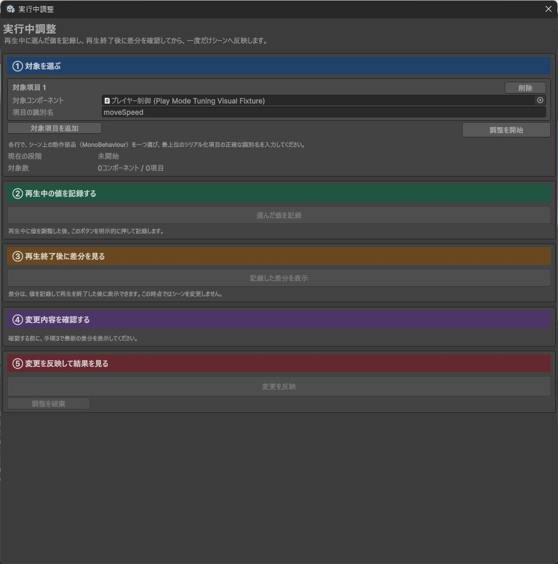
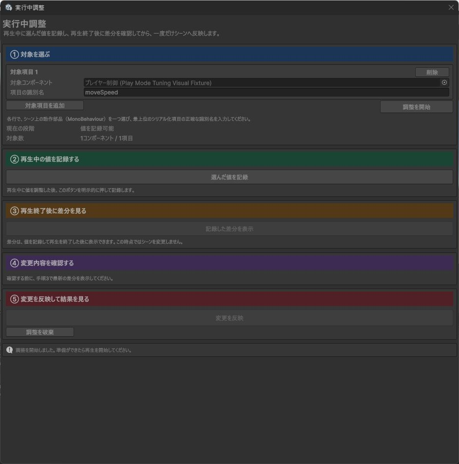
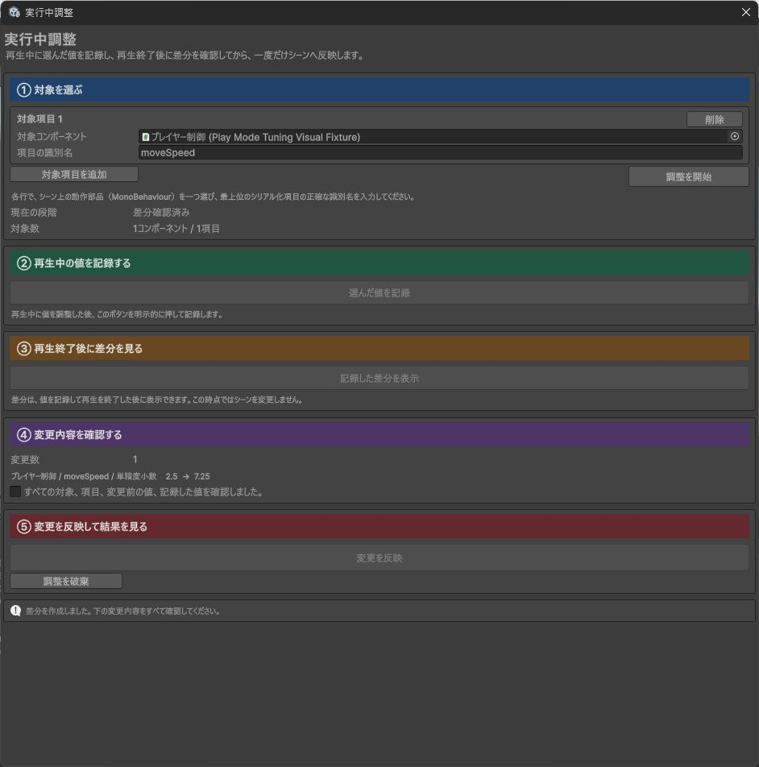

# 実行中調整 詳細仕様

## 解決する問題

再生モードで値を調整した結果を残したい場合、通常は値を控え、再生終了後に同じ値を入力し直します。対象が複数になると、取り違え、入力漏れ、再生中だけ存在するオブジェクトの誤選択が起きやすくなります。

実行中調整は、「対象を先に固定する」「再生中に手動で記録する」「再生終了後に差分を見る」「確認した同じ計画を1回だけ反映する」という一つの有界な操作として扱います。

## 実画面で確認する

操作案内図は、実際のエディター画面に①から⑤の対応箇所を示します。

再生モード中は、②「再生中の値を記録する」だけが有効になります。

再生終了後、③「再生終了後に差分を見る」で変更前と記録した値を表示します。

## 責務の境界

### このモジュールが所有するもの

- 事前に選ばれたコンポーネントと項目の安定した識別情報
- 編集モードの変更前の値と、再生中に手動で記録した値
- エディター作業領域（`SessionState`）に保持する有界な状態遷移
- 決定論的な差分順と計画の版指紋
- 同じ計画オブジェクトの単回消費
- 反映直前、反映後、復元後に行う、選択値と対象シーン階層の検証
- 成功した反映の取り消し履歴
- 成功時の`EditorSceneManager.MarkSceneDirty`

### 所有しないもの

- ゲームの調整方法や適切な値の判断
- 実行時コードとプレイヤー用ビルド
- シーン、プレハブ、アセットの保存
- 再生モードの開始・終了
- 選択していない値の意図的な変更
- 選択対象のない別シーン、プロジェクト資産、シーン階層外の設定
- 他モジュールの設定

## 状態遷移

未開始（`Idle`）→再生開始待ち（`Armed`）→値を記録可能（`Capturable`）→値を記録済み（`Captured`）→差分確認待ち（`ReadyToPreview`）→差分確認済み（`Previewed`）→完了または無効（`Completed` / `Stale`）

- 再生開始待ち（`Armed`）：①で対象と編集モードの変更前の値を固定済み
- 値を記録可能（`Capturable`）：対応する再生モードへ入り、②を手動実行できる
- 値を記録済み（`Captured`）：選択値を記録済みで、再生終了待ち
- 差分確認待ち（`ReadyToPreview`）：編集モードへ戻り、③の差分表示を実行できる
- 差分確認済み（`Previewed`）：同じ反映予定（`PlayModeTuningPlan`）を1回だけ⑤へ渡せる
- 完了（`Completed`）：反映、失敗後の復元、差分なし、または破棄で終了
- 無効（`Stale`）：識別情報、再読込設定、変更前の値、実行領域、調整作業のいずれかが一致せず終了

状態管理処理（`PlayModeTuningLifecycle`）が自動で行うのは状態の移動だけです。値の記録、差分表示、反映、保存は自動実行しません。

## 識別情報と版指紋

コンポーネントの識別情報は、次の文字列を長さ付きのUTF-8として、識別指紋を作る方式（`SHA-256`）へ入力します。

- 大域識別子（`GlobalObjectId`）
- シーンの資産識別子（`GUID`）とパス
- 動作スクリプト（`MonoScript`）の資産識別子
- アセンブリ修飾型名

項目の識別情報には、さらにシリアル化項目識別名（`SerializedProperty.propertyPath`）、シリアル化項目型（`SerializedPropertyType`）、数値型を含めます。差分表示、版指紋計算、記録、反映、復元は大域識別子（`GlobalObjectId`）の文字列序数順、同じ対象では項目識別名、項目型、数値型、コンポーネント識別キーの文字列序数順へ固定します。選択順や識別指紋（`SHA-256`）の値順には依存しません。ヒエラルキーパス、名前、実行中だけの識別子（`InstanceID`）を代替識別情報として使いません。

計画の版指紋は、調整作業の識別子、`Nonce`、全項目の識別情報、変更前と記録後の値、対象シーン階層にある選択外項目の指紋から作ります。

選択外項目の指紋は、選択対象が一つ以上ある各シーンについて、ルートの`GameObject`から子階層をたどり、全`GameObject`と全コンポーネントの最上位シリアル化項目を読み取って計算します。選択項目だけを指紋から除き、オブジェクトの追加・削除、コンポーネントの追加・削除、欠落したスクリプトも検出対象に含めます。

選択対象のない別シーンは走査しません。`ScriptableObject`などのプロジェクト資産、`RenderSettings`などシーン階層の外にある設定、シリアル化されない状態も指紋の対象外です。選択項目の反映をきっかけにこれらが変わっても、このモジュールは検出や復元を保証しません。

指紋の取得と、既存オブジェクトのシリアル化値に対する取り消し記録では、対象シーンの全階層を走査します。大きなシーンや多数のコンポーネントを含むシーンでは、調整開始、再生中の記録、差分表示、反映後確認、失敗後確認に時間がかかる場合があります。

## 値の表現

`float`と`double`は、生のビット列を8桁または16桁の16進数として保持します。差分画面の十進表示は保存済み表示文字列を信用せず、正確な符号化値から往復変換できる形式で再生成します。`Vector`、`Color`、`Rect`、`Bounds`、`Quaternion`も全要素を同じ形式で表示します。

符号付き・符号なし整数はUnityの`SerializedPropertyNumericType`に応じて読み書きします。文字列はUTF-8のバイト数を先に確認し、値を`Base64`で保持します。

Unity 6000.5.7f1では`SerializedPropertyType.String`の`isArray`が`true`でした。このため、一般の配列拒否より先に文字列を判定します。通常の配列と`List`は拒否します。

`Color`、`Vector`、`Rect`、`Bounds`、`Quaternion`の浮動小数点要素もすべて有限であることを確認し、生のビット列で比較します。

## 再読込条件

調整作業の状態はエディター作業領域（`SessionState`）に、構造化した文字列（`JSON`）として保持します。

- 通常のスクリプト領域再読み込み（`Domain Reload`）：再生モード進入時に実行領域の印が変わることを必須確認
- スクリプト領域再読み込みの無効設定（`Disable Domain Reload`）：再生モード進入時に実行領域の印が変わらないことを必須確認
- 再生終了時の印の変化: 観測だけを行い、成功条件にはしない
- シーン再読み込みの無効設定（`Disable Scene Reload`）：大域識別子（`GlobalObjectId`）と編集モードの値の復元契約を満たさないため拒否

エディター作業領域（`SessionState`）を読み直すたびに、形式版、状態、件数、コンポーネントと項目の識別情報、値形式、文字列上限、合計バイト数を検査します。壊れた保存状態はシーンを変更せず、保存データ不正（`SessionDataInvalid`）を持つ無効状態（`Stale`）として正規化します。

## 差分表示と単回消費

差分表示前に、編集モードの選択値と対象シーン階層の選択外項目の指紋が、調整開始時点と一致することを確認します。表示する対象名は保存値ではなく、正確な識別情報から解決した現在の`GameObject`から取得します。差分は項目識別情報の文字列序数順です。

反映は、登録済みの同じ反映予定（`PlayModeTuningPlan`）オブジェクトと、その作業識別子（`SessionId`）、単回識別子（`Nonce`）、内容版（`Revision`）だけを受け付けます。保存値、直接の識別情報、変更済みにする対象シーンのパスから版指紋を再計算し、差分表示時と一致することも確認します。計画はUnityオブジェクトを書き換える前に消費します。複製したデータ型、再使用、スクリプト領域再読み込み後、調整作業の食い違いは反映しません。

## 反映、取り消し、復元

反映前に、すべての対象と項目が現在も正確に解決できることを確認します。次に、選択対象があるシーンの全階層にある既存オブジェクトを専用の取り消しグループへ記録し、変化する選択項目だけを書き込みます。反映後の検証と変更済み設定まで成功した場合に記録を確定するため、選択項目の書き込みに伴って同じ対象シーン階層内で変化したシリアル化値も、一つのUnity取り消し操作として元へ戻せます。

この取り消し記録は、既存オブジェクトのシリアル化値を対象にします。オブジェクトやコンポーネントの追加・削除、親子関係の変更など、専用の取り消し操作を必要とする構造変更は指紋で検出しますが、自動復元を保証しません。構造変更が残った場合は`RollbackFailed`として報告するため、対象シーンを確認して手動で戻してください。

反映後に次を再取得します。

- 全選択項目が記録後の符号化値と完全一致すること
- 対象シーン階層にある全選択外項目の`contentHash`指紋が反映直前と一致すること
- 対象識別情報と項目型が一致すること

`OnValidate`などが同じ対象シーン階層内の選択外項目や階層構造を変更した場合も、選択項目だけが一致した状態を成功とはしません。ただし、選択対象のない別シーン、プロジェクト資産、シーン階層外の設定に生じた副作用は検出対象外です。

反映または反映後確認に失敗した場合は、この反映が作成した取り消しグループだけを戻します。復元後は、全選択値の完全一致、対象と項目の識別情報、対象シーン階層の選択外項目の指紋を反映直前の取得結果と比較します。差が残る場合は復元成功として扱いません。反映結果と復元結果は独立して返します。

復元後確認では、対象シーンの階層構造と階層内のシリアル化値を再検査します。この確認範囲は、自動復元を保証する範囲より広く、構造変更が残れば復元失敗を検出します。選択対象のない別シーン、`ScriptableObject`などのプロジェクト資産、`RenderSettings`などの階層外設定、シリアル化されない状態、シーンの変更済み印そのものは、復元確認の対象ではありません。

成功時は対象シーンごとに`EditorSceneManager.MarkSceneDirty`を明示的に呼び、`Scene.isDirty == true`を確認します。シーンやアセットは自動保存しません。

## 例外の扱い

利用者が修正できる不一致は`PlayModeTuningError`と日本語説明で返します。未知の列挙値は数値を残して表示します。

予期しない例外は完全な内容をUnityコンソールへ記録し、利用者向け画面には内部の例外文や環境依存パスを表示しません。例外後も画面の操作状態を維持し、必要に応じて「調整を破棄」を実行できるようにします。

`SessionState`への読み書きに失敗した場合は`SessionStorageFailed`を返します。再生開始または終了に伴う状態更新では、現在の再生状態を再確認しながら状態更新だけを最大3回自動再試行します。復旧しない場合は「状態更新を再試行」から明示的に再試行できます。値の記録、差分表示、反映は自動再実行しません。

反映を取り消し履歴として確定する前に、`Stale`と`SessionStorageFailed`を持つ無効な安全状態を保存します。履歴確定後の最終結果を保存できない場合も、同じ取り消し単位を復元してから失敗状態を保存します。反映結果と失敗状態を続けて保存できない場合は、古い成功状態または使用途中の計画を残さないため、保存されていた調整データの消去を試みます。消去にも失敗した場合でも安全状態を残すため、再読込後に成功と誤表示しません。対象シーンと取り消し履歴を確認してからUnityエディターを再起動してください。

## 上限

| 項目 | 上限 |
| --- | --- |
| コンポーネント | 32 |
| 選択項目 | 256 |
| 変更前と記録後の符号化値 | 256 KiB |
| 1文字列 | UTF-8で4096バイト |
| 有効な調整作業 | 1 |
| 計画の登録数 | 64 |

## 主な失敗理由

| `PlayModeTuningError` | 条件 | 値の反映 |
| --- | --- | --- |
| `DisableSceneReloadUnsupported` | `Disable Scene Reload`が有効 | なし |
| `DomainReloadMismatch` | 再生進入時の実行領域の印が設定と不一致 | なし |
| `UnsupportedTarget` | アセット、プレハブ、未保存シーン、`MonoBehaviour`以外 | なし |
| `UnsupportedProperty` | 入れ子、配列、オブジェクト参照など | なし |
| `NonFiniteValue` | `NaN`または`Infinity` | なし |
| `TooManyComponents` | 33コンポーネント以上 | なし |
| `TooManyProperties` | 257項目以上 | なし |
| `PayloadTooLarge` | 合計256 KiB超過 | なし |
| `SessionDataInvalid` | `SessionState`の形式、識別情報、値、上限が不正 | なし |
| `SessionStorageFailed` | `SessionState`への読み書き、または失敗後の安全な消去に失敗 | 反映前ならなし、反映後なら復元を試行 |
| `StaleSession` | 変更前の値または未選択項目の指紋が変化 | なし |
| `StalePlan` | 正確な計画識別情報が不一致 | なし |
| `PlanAlreadyConsumed` | 同じ計画オブジェクトを再使用 | なし |
| `VerificationFailed` | 反映後に選択項目または対象シーン階層の選択外項目が不一致 | 復元を試行 |
| `SceneDirtyFailed` | シーンを明示的に変更済みにできない | 復元を試行 |
| `RollbackFailed` | 復元後に選択項目または対象シーン階層の選択外項目が不一致 | 自動処理を終了 |

## 検証方針

- Unity APIに依存しない試験で、状態遷移、計画作成、版指紋、単回使用、符号化値上限を固定します。
- 模擬入口で、古い状態、保存値・表示・対象名の改変、作業データの保存失敗と二重失敗、部分失敗、選択項目と対象シーン階層の選択外項目への副作用、復元後の残留変更、シーン変更済み化の失敗を人工的に作ります。
- 実際の`SerializedObject`で、文字列の`isArray`特例、非対応の配列・入れ子・参照・`AnimationCurve`・`Gradient`、`float`と`double`の生ビット往復を固定します。
- 実際の保存済みシーンで、反映、同じシーンの別コンポーネントに生じる値の副作用の検出と復元、構造変更が取り消し対象外であること、一括取り消し、自動保存なしを確認します。
- 通常設定では再生進入時の実行領域の印が変わり、`Disable Domain Reload`では変わらないことを確認します。
- 画面見出しが①から⑤の順で、差分表示が値の記録より下、反映が最後であることを固定します。
- 編集用試験を`Tests/Editor`の`PlayModeTuning.Editor.Tests`として実行し、公開XML文書とアセンブリ配置を`Package Validation Suite`で検査します。
