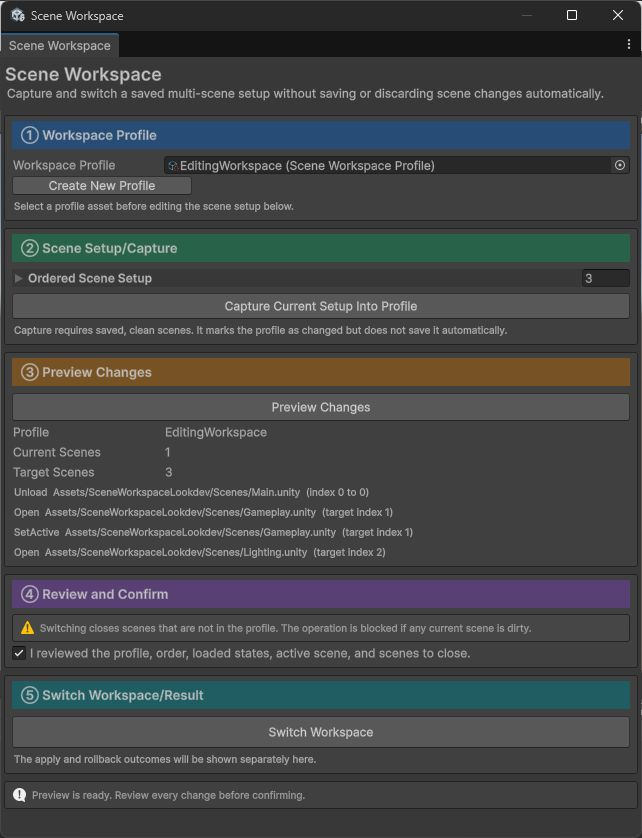

# シーン作業セット 詳細仕様

## 解決する問題

通常の Unity Editor では、作業内容を切り替えるたびに複数 Scene を開閉し、順番、Loaded、Active を手動で戻す必要があります。操作数が多いだけでなく、閉じる Scene や Active Scene を取り違える余地があります。

Scene Workspace は、この一連の操作を 1 つの「Scene 構成切り替え」として扱います。Profile の設定、差分 Preview、確認、切り替え、結果確認を ①から⑤まで上から順に進めます。

## 実画面で確認する

次のガイドは、実際の Scene Workspace Window に ①から⑤の対応箇所を加えたものです。設定欄の後に Preview、最後に確認済みの切り替えが並びます。

640 px 幅でも同じ順序を維持し、横方向へはみ出しません。最小の 640 x 560 px では縦にスクロールして ①と⑤へ到達します。

## 責務の境界

### このモジュールが所有するもの

- `SceneWorkspaceProfile` に保存する Scene の順番、Loaded、Active
- 現在の Editor Scene 構成の読み取り
- Profile との差分計算
- 確認済み計画の単回使用と古さの判定
- `EditorSceneManager.RestoreSceneManagerSetup` を使う切り替え
- 適用後の再取得と一致確認
- 途中失敗時の元構成への復元試行

### 所有しないもの

- Scene 内の GameObject や Component の内容
- Scene Asset の保存、変更破棄、削除
- Runtime の Scene 読み込み
- Build Settings、Build Profile、Player Settings
- 他モジュールの登録情報や設定

Runtime assembly はありません。Editor assembly だけなので、Mono と IL2CPP の Player 出力および実行時挙動には影響しません。

## ①から⑤までの操作

### ① Workspace Profile

Project 内の `SceneWorkspaceProfile` を選びます。新規作成する場合も `Assets` 以下へ保存します。保存されていない一時 Object は Preview できません。

### ② Scene Setup/Capture

Profile の配列順が Scene の目標順です。各要素には次を設定します。

- `Scene`: `Assets` 以下の `.unity` Asset
- `Loaded`: 切り替え後に読み込むか
- `Active`: 切り替え後の Active Scene か

Loaded は最低 1 件、Active は Loaded の中から正確に 1 件必要です。

`Capture Current Setup Into Profile` は、現在の有効な構成を同じ順番で Profile へコピーします。Scene と Profile は自動保存しません。

### ③ Preview Changes

Preview は Scene 構成を変更しません。最初に現在にだけ存在する Scene の `Close` を現在順で返し、続いて Profile の各 Scene を Profile 順で処理します。

- Profile に新しく加わる Scene は `Open`、必要なら続けて `SetActive`
- 現在にもある Scene は `Load` または `Unload`、`Reorder`、`SetActive` の順
- 現在にもあり、どの状態も変わらない Scene は `Keep`

1 Scene に複数の違いがある場合は、複数行で表示します。

### ④ Review and Confirm

Preview が成功した計画だけを確認できます。確認後に Window 内の Profile 設定を変更すると、計画と確認欄を破棄します。Window 外から Profile が変わった場合も、Apply 直前の再比較で停止します。

### ⑤ Switch Workspace/Result

計画は 1 回だけ Apply できます。Apply 直前に現在の Scene 構成と Profile を再取得し、Preview 時の fingerprint と revision に一致することを確認します。

一致した場合だけ Profile の構成を復元します。その後に再取得し、次を完全一致で確認します。

- Scene 件数
- 配列順
- GUID と path
- Loaded
- Active
- Dirty ではないこと

一致しない場合や例外が発生した場合は、Preview 時の元構成への復元を 1 回試み、復元後も同じ項目を確認します。

## Apply と Rollback の結果

`SceneWorkspaceApplyResult` は次を別々に持ちます。

- `ApplyAttempted` / `ApplySucceeded` / `ApplyError` / `ApplyMessage`
- `RollbackAttempted` / `RollbackSucceeded` / `RollbackError` / `RollbackMessage`

Apply 失敗後に Rollback が成功しても、元の Apply 失敗は成功扱いに変えません。Rollback が失敗した場合は `RollbackFailed` を別に返します。

Apply 前の再確認で停止した場合は `ApplyAttempted` が `false` で、Rollback は不要です。

## fingerprint と revision

現在の構成 fingerprint には、順番、Scene GUID、path、存在状態、Loaded、Active、Dirty を長さ付きで連結し、SHA-256 で記録します。

Profile revision には、Profile GUID、path、名前と、順番付きの Scene GUID、path、存在状態、Loaded、Active を記録します。Scene Asset 内部の GameObject 内容はこのモジュールの責務外なので、revision には含めません。

計画の世代管理は Editor Domain 内の最大 64 件です。上限を超えた古い計画、Domain Reload 前の計画、別 Object に複製された計画は `StalePlan` として拒否します。使用済みの同一計画は `PlanAlreadyConsumed` です。

## 失敗条件

| Error | 停止する条件 | Scene 変更 |
| --- | --- | --- |
| `InvalidProfile` | Profile 未選択 | なし |
| `ProfileNotSaved` | Profile が `Assets` 以下の Asset ではない | なし |
| `NoScenes` | 現在または Profile が空 | なし |
| `MissingScene` | Scene Asset または GUID が欠損 | なし |
| `DuplicateScene` | GUID または path が重複 | なし |
| `UntitledScene` | 保存されていない Scene が開いている | なし |
| `DirtyScene` | 未保存変更を持つ Scene がある | なし |
| `UnsupportedScenePath` | `Assets` 以下の `.unity` ではない | なし |
| `NoLoadedScene` | Loaded が 0 件 | なし |
| `InvalidActiveScene` | Active が 1 件ではない、または Unloaded | なし |
| `PlayModeActive` | Play Mode 中または切り替え中 | なし |
| `EditorBusy` | コンパイル中または Asset 更新中 | なし |
| `PrefabStageOpen` | Prefab Mode 中 | なし |
| `StalePlan` | 現在、Profile、世代、Object identity が一致しない | なし |
| `PlanAlreadyConsumed` | 同じ計画を再使用 | なし |
| `ApplyInProgress` | 別の切り替え処理が実行中 | なし |
| `ApplyFailed` | Unity の構成復元呼び出しが失敗 | 部分変更の可能性があるため Rollback |
| `VerificationFailed` | 適用後の再取得が不一致 | Rollback |
| `RollbackFailed` | 元構成の復元または確認に失敗 | 自動処理を終了 |

## 公開 API

### `SceneWorkspaceService.CaptureCurrentSetup()`

現在の構成を検査して `SceneWorkspaceCaptureResult` を返します。変更は行いません。

### `SceneWorkspaceService.Preview(SceneWorkspaceProfile)`

現在と Profile を取得し、`SceneWorkspacePlan` を返します。成功した計画には generation、Profile revision、現在の fingerprint、現在・目標 Scene、差分が含まれます。

### `SceneWorkspaceService.Apply(SceneWorkspacePlan)`

計画を単回消費し、再確認、適用、適用後確認を行います。必要な場合だけ Rollback を試みます。

公開 DTO の collection は読み取り専用 copy です。Profile は Inspector と Window から明示的に編集する `ScriptableObject` であり、計画 DTO から直接参照しません。

## 検証方針

- planner は Unity API から分離し、同じ snapshot から同じ差分順を返すことを確認する。
- Play、compile、update、Prefab Mode、Dirty、無題、欠損、重複、Loaded なし、Active 不正で Restore を 1 回も呼ばないことを確認する。
- Preview 後の現在構成と Profile revision の変化を別々に確認する。
- 同一計画の再使用、同じ generation を持つ別 Object、64 件を超えた古い計画を拒否する。
- Apply 例外と適用後不一致の両方で元構成を Restore し、再確認する。
- Rollback の成功と失敗を Apply の結果から独立して確認する。
- UI の見出しが ①、②、③、④、⑤の順で、設定の後に Preview、最後に Apply があることを固定する。
- Unity 6000.5.7f1 の実 Window で 840 x 780、640 x 780、最小 640 x 560 の上端・下端を確認し、横切れ、重なり、到達不能な操作がないことを確認する。
