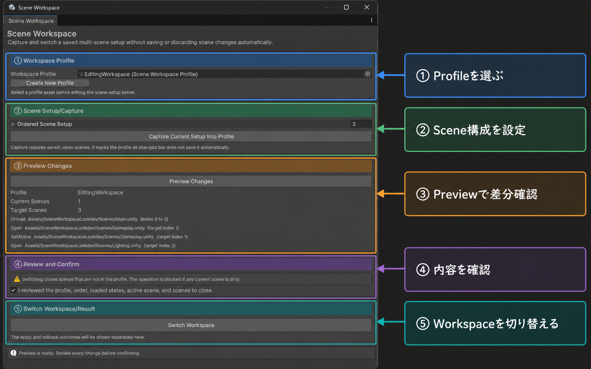
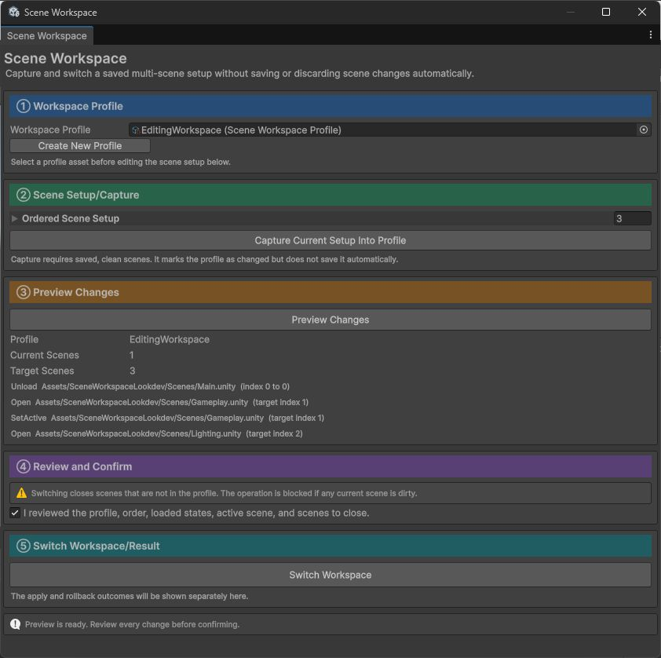

# シーン作業セット（Scene Workspace）

## 30 秒で分かる説明

複数の Scene を毎回開き直し、読み込み状態と Active Scene を手作業で戻す手間を減らす Editor 専用モジュールです。

たとえば「ゲームプレイ編集用」「ライティング確認用」「UI 調整用」の Scene 構成を Profile として保存できます。設定後に `Preview Changes` で変更内容を確認し、同じ計画だけを `Switch Workspace` で一度だけ適用します。

Scene の未保存変更を勝手に保存・破棄しません。Dirty Scene、無題 Scene、欠損 Scene などが 1 件でもあれば、Scene を開閉する前に停止します。

## 画面で見る操作順

設定は ① Profile、② Scene 構成、③ Preview、④ 確認、⑤ 切り替えの順です。Preview は Scene 構成を設定した後、実際の切り替えは確認した後にあります。

注釈なしの実画面を確認する

`Main`、`Gameplay`、`Lighting` の 3 Scene を使い、現在との差分を Preview した実際の Editor Window です。

## 何が便利になるか

- 複数 Scene の順番、Loaded、Active を 1 つの Profile にまとめられます。
- 現在の Scene 構成を Profile へ明示的に取り込めます。
- 閉じる、開く、読み込む、読み込み解除、並べ替える、Active にする変更を適用前に一覧で確認できます。
- Preview 後に現在の構成または Profile が変わった場合は、古い計画を適用しません。
- 適用後に順番、Scene、Loaded、Active、Dirty を再確認します。
- 途中失敗時は元の Scene 構成への復元を試み、適用結果と復元結果を別々に表示します。

## 使い方

Unity メニューの `Tools > Scene Workspace > Open` を開き、必ず上から順に設定します。

### ① `Workspace Profile`

既存の `SceneWorkspaceProfile` を選ぶか、`Create New Profile` で新しく作ります。

### ② `Scene Setup/Capture`

Profile の Scene を上から希望順に並べ、各 Scene の `Loaded` と `Active` を設定します。Active にできるのは Loaded の Scene 1 件だけです。

現在開いている構成を使う場合は `Capture Current Setup Into Profile` を押します。この操作は Profile を変更済みにしますが、自動保存はしません。内容を確認してから通常の Unity 操作で Profile を保存してください。

### ③ `Preview Changes`

すべての設定が終わってから `Preview Changes` を押します。この段階では Scene を開閉せず、現在と Profile の差だけを表示します。

### ④ `Review and Confirm`

Scene の順番、Loaded、Active、閉じる Scene を確認し、確認欄をオンにします。Profile を編集した場合は Preview が無効になるため、③からやり直します。

### ⑤ `Switch Workspace/Result`

`Switch Workspace` を押します。実行直前に現在の構成と Profile を再取得し、③と一致した場合だけ切り替えます。

結果欄では `Apply` と `Rollback` を分けて確認できます。`Rollback: Failed` の場合は自動操作を続けず、Unity の Hierarchy と Scene の状態を手動で確認してください。

## 利用できない状態

次の場合は Preview または Apply を Scene 変更前に停止します。

- Play Mode 中、または Play Mode へ切り替え中
- コンパイル中、Asset 更新中
- Prefab Mode を開いている
- Dirty Scene、無題 Scene、欠損 Scene、重複 Scene がある
- `Assets` 以下の `.unity` ではない Scene がある
- Loaded Scene が 0 件
- Active Scene が 1 件ではない、または Active Scene が Unloaded
- Profile が Project の `Assets` 以下へ保存されていない
- Preview 後に現在の構成または Profile が変わった
- 同じ Preview 計画を既に使用した、または古い世代の計画になった

## 自動では行わないこと

- Scene の保存または変更破棄
- Scene Asset、GameObject、Component の作成・削除・置換
- Runtime の Scene 遷移
- Build Profile、Build Settings、Player Settings の変更
- Profile Asset の自動保存

このモジュールは Editor 専用 assembly です。Mono と IL2CPP のどちらの Player にも Runtime code を追加しません。

## スクリプトから使う場合

公開入口は `SceneWorkspace.Editor.SceneWorkspaceService` です。

- `CaptureCurrentSetup()`
- `Preview(SceneWorkspaceProfile profile)`
- `Apply(SceneWorkspacePlan plan)`

`SceneWorkspaceCaptureResult`、`SceneWorkspacePlan`、`SceneWorkspaceApplyResult` とその公開 collection は、呼び出し側から内容を書き換えられません。`SceneWorkspacePlan` は 1 回だけ使用できます。Domain Reload または古い計画の上限超過後は安全側で `StalePlan` になります。

失敗条件、検証範囲、復元結果の読み方は [詳しい仕様](Documentation~/index.md) を参照してください。
